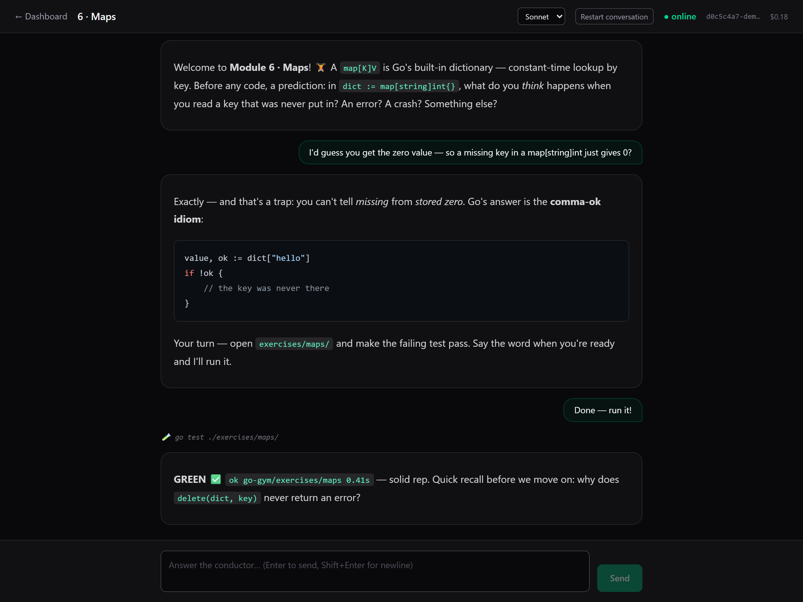

# The Go Gym 🏋️

**Learn Go by doing — with an AI tutor that actually teaches.**

📖 **[Read the book online →](https://cicksuy1.github.io/Go-Gym-The-book/)**

The Go Gym is an open-source Go course you take *with an AI assistant*. You read a short, why-first
chapter, then make a failing test pass. Your AI explains the idea, watches you do the rep, tests your
memory, and only moves on when you've genuinely got it. No passive video-watching, no terse walls of code.

It's inspired by two things: the **test-driven rigor** of
[*Learn Go with Tests*](https://quii.gitbook.io/learn-go-with-tests/), and the **why-first, mental-model
storytelling** of [the Rust Book](https://doc.rust-lang.org/book/).

## Who it's for

- You want to learn Go and have an AI coding assistant (Claude Code, or any agent that reads `AGENTS.md`).
- You've bounced off terse tutorials and want the *why* before the *how*.
- You learn by building, not by watching.

## How it works — three layers (plus an optional GUI)

1. **A book** ([read online](https://cicksuy1.github.io/Go-Gym-The-book/) — `book/`, built with [mdBook](https://rust-lang.github.io/mdBook/)) — one why-first chapter per concept.
2. **Exercises** (one Go package per module) — each ships a failing test you make pass.
3. **An AI conductor** (`AGENTS.md`) — runs you through it: explains, gates on real `go test` results,
   quizzes you, tracks progress, and keeps the pace sane so you don't burn out.
4. **(Optional) The Gym GUI** ([`gym-app/`](gym-app/README.md)) — a local web app that puts the same
   conductor conversation in your browser, with streaming replies, live progress, and celebrations.

> **Note:** the Gym GUI currently works with **Claude Code only** — it runs on the Claude Agent SDK
> and reuses your local Claude Code login. The course itself still works with any agent that reads
> `AGENTS.md`.



The chat auto-detects text direction per message — learn in Hebrew (or any RTL language) and the
prose renders right-to-left while Go code stays left-to-right.

Every module follows the same loop: **why-first → tiny example → make the test green → recall quiz →
real code in the wild.**

## Status

The course ships in five Parts. Progress so far:

- [x] **Part 0 — Getting Started** — install Go, project & package structure
- [x] **Part 1 — Go Fundamentals** — 19 chapters (integers → generics) ✅ live
- [ ] **Part 2 — Testing Fundamentals**
- [ ] **Part 3 — Build an Application**
- [ ] **Part 4 — Q&A + Meta**

The full per-chapter list and statuses live in **[`CURRICULUM.md`](CURRICULUM.md)**.

## Quickstart

**Prerequisites:** [Go](https://go.dev/dl/) 1.26+, an AI coding agent, and optionally:
[mdBook](https://rust-lang.github.io/mdBook/guide/installation.html) (read the book in a browser) and
[go-task](https://taskfile.dev/installation/) (one-command shortcuts — see *One command each: the Taskfile* below).

```bash
winget install Task.Task   # Windows          (or: choco install go-task)
brew install go-task       # macOS / Linuxbrew
```

mdBook is only needed if you want to read the book locally — the course itself runs through your AI agent
and `go test`. Install it whichever way suits you:

```bash
cargo install mdbook    # via the Rust toolchain (any platform)
winget install mdBook   # Windows, no Rust needed
```

```bash
# 1. Get the course
git clone <your-fork-url> go-gym && cd go-gym

# 2. (optional) read the book in your browser at http://127.0.0.1:3000
mdbook serve book

# 3. Make your private progress file
cp progress/PROGRESS.template.md progress/PROGRESS.local.md

# 4. Open the folder in your AI agent and say:
#    "start the Go Gym"
```

Your agent reads `AGENTS.md`, sees you're at Module 1, and begins. From then on: `continue`, `next`,
`test me`, `where am I`, `I'm stuck`, or `add an exercise`.

### Four ways to start
- **Any agent:** it auto-reads `AGENTS.md`; just say *"start the Go Gym."*
- **Claude Code:** run the **`/go-gym`** skill — it shows where you are and drives the next module.
- **Prefer a GUI?** `task setup && task app`, then open `http://localhost:4600` for the tutor chat
  (Claude Code required) — see [`gym-app/README.md`](gym-app/README.md).
- **Prefer reading first?** Follow this README, `mdbook serve book`, and let your agent take it from there.

## One command each: the Taskfile 🛠️

The repo ships a [`Taskfile.yml`](Taskfile.yml) so every common move is one command
(needs [go-task](https://taskfile.dev/installation/) — see prerequisites above):

| Command | What it does |
|---------|--------------|
| `task --list` | Show every available command. |
| `task setup` | One-time install for the Gym GUI (server + web deps). |
| `task up` | Serve the book (`:3000`) **and** the Gym GUI (`:4600`) together. |
| `task app` / `task app:dev` | Run just the GUI (production / dev with hot reload). |
| `task book` / `task book:build` | Serve / build the book. |
| `task test SLUG=arrays` | Run *your* rep for one module — red until you make it green. |
| `task qa` | Author gates: vet + reference solutions GREEN + book builds clean. |

No go-task? Everything also works as plain commands — `go test ./exercises/<module>/`,
`mdbook serve book`, and `npm run start` inside `gym-app/`.

## Curriculum & progress

The full module list and the graduation bars live in **[`CURRICULUM.md`](CURRICULUM.md)** (the single
source of truth). Your personal progress lives in `progress/PROGRESS.local.md` (gitignored — it never
leaves your machine).

## Contributing

Want to write or improve a chapter? See **[`CONTRIBUTING.md`](CONTRIBUTING.md)** — chapters follow a fixed
10-section anatomy and a build-tag reference-solution convention, both enforced by the AI's QA mode.

## License

[MIT](LICENSE).
